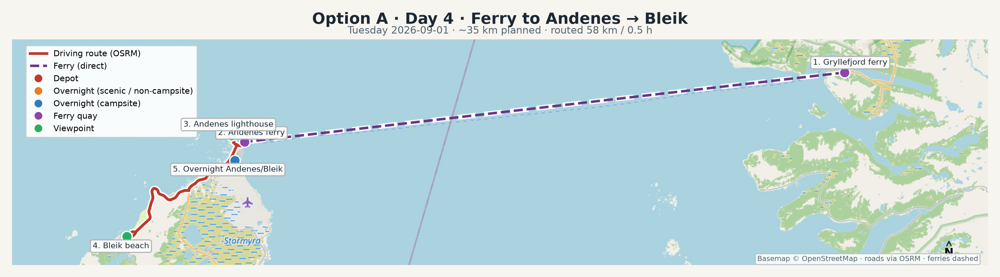

# Day 4 — Ferry to Andenes → Bleik

**Tuesday 2026-09-01** · Option A

- Approximate driving: **~35 km / 0.8 h** (stops extra)
- Overnight: **Andenes / Bleik campsite** (campsite) — alt: Bleik beach parking overnight if legal/quiet

## Map

GPX: [`maps/day-04.gpx`](../maps/day-04.gpx)

## Ferry

- Route: **180 Gryllefjord → Andenes**
- Duration: ~100 min
- Target departure: **11:00**
- Backup sailings: 19:00
- Note: From 24 Aug–27 Sep 2026: only 11:00 and 19:00 from Gryllefjord. No vehicle booking — first come, first served. Arrive 2–3h early with a camper.
- Source: https://svipper.no/_f/p1/ib5455b64-e81b-4f9e-a9bf-20150e215f93/180-gryllefjord-andenes_rutetabell.pdf

## Stops

1. **Gryllefjord ferry** (ferry) — `69.36150, 17.05200`
2. **Andenes ferry** (ferry) — `69.32400, 16.13500`
3. **Andenes lighthouse** (viewpoint) — `69.32750, 16.11500`
4. **Bleik beach** (viewpoint) — `69.27300, 15.95500`
5. **Overnight Andenes/Bleik** (sleep) — `69.31400, 16.12000`

## Optional

- Whale safari from Andenes — book same-day/morning if weather & seats look good.

## Notes

- If you miss 11:00, use Day 6 flexibility and take 19:00.
- Bleik at golden hour is a highlight — drone: check wind + bird cliffs restrictions.

## Camper logistics

- Prefer **campsite nights** for showers, laundry, fresh water, and dump.
- On **scenic nights**, use legal pull-offs: no private land, leave no trace, keep distance from houses (allemannsretten).
- Fuel when you see a station — remote stretches have gaps.
