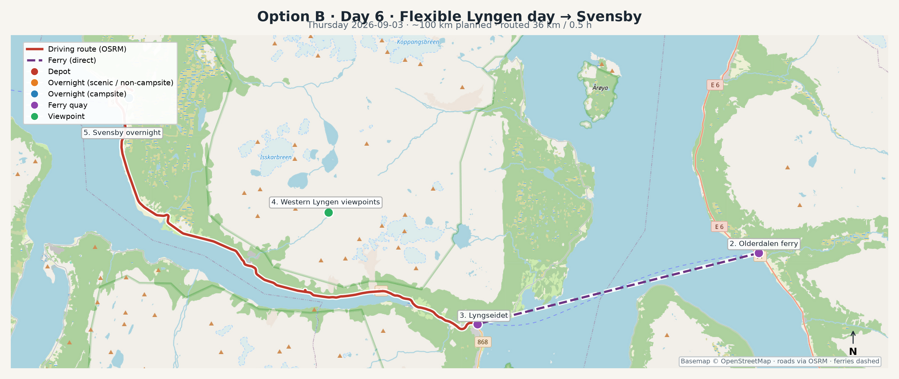

# Day 6 — Flexible Lyngen day → Svensby

**Thursday 2026-09-03** · Option B

- Approximate driving: **~100 km / 2.5 h** (stops extra)
- Overnight: **Svensby / Ullsfjord campsite area** (campsite) — alt: Ullsfjord pull-off if facilities not needed

## Map

GPX: [`maps/day-06.gpx`](../maps/day-06.gpx)

## Ferry

- Route: **190 Olderdalen → Lyngseidet**
- Duration: ~40 min
- Note: Joker day — linger for light/weather on either shore, then sleep near Svensby for an easy Friday ferry.

## Stops

1. **Olderdalen** (start) — `69.60400, 20.53500`
2. **Olderdalen ferry** (ferry) — `69.60400, 20.53500`
3. **Lyngseidet** (ferry) — `69.57600, 20.21800`
4. **Western Lyngen viewpoints** (viewpoint) — `69.62000, 20.05000`
5. **Svensby overnight** (sleep) — `69.66500, 19.82500`

## Notes

- Flexible day (same philosophy as Option A Day 6).
- Good weather: drone + slow coastal photography on the west side after ferry.
- Bad weather: café time in Lyngseidet, earlier campsite at Svensby.

## Camper logistics

- Prefer **campsite nights** for showers, laundry, fresh water, and dump.
- On **scenic nights**, use legal pull-offs: no private land, leave no trace, keep distance from houses (allemannsretten).
- Fuel when you see a station — remote stretches have gaps.
